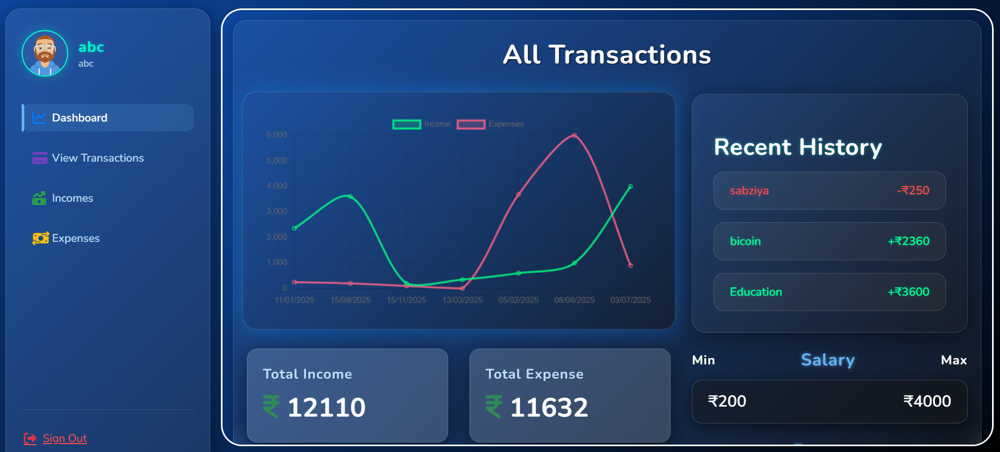
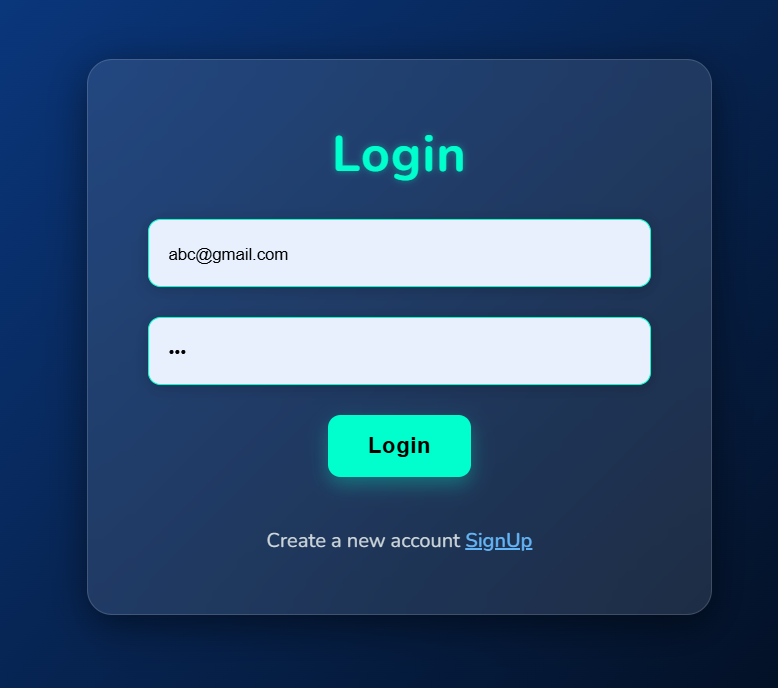
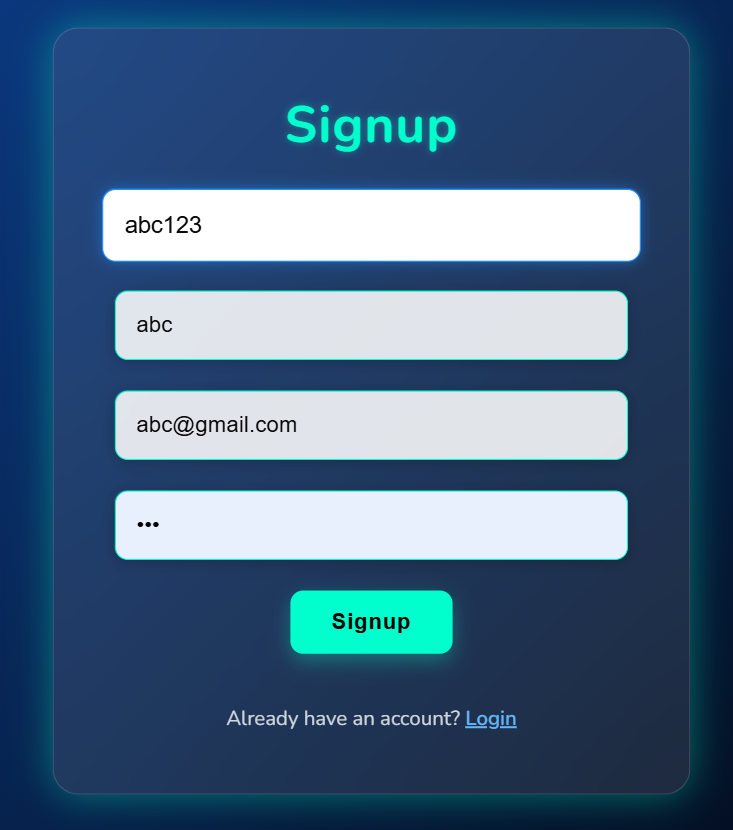
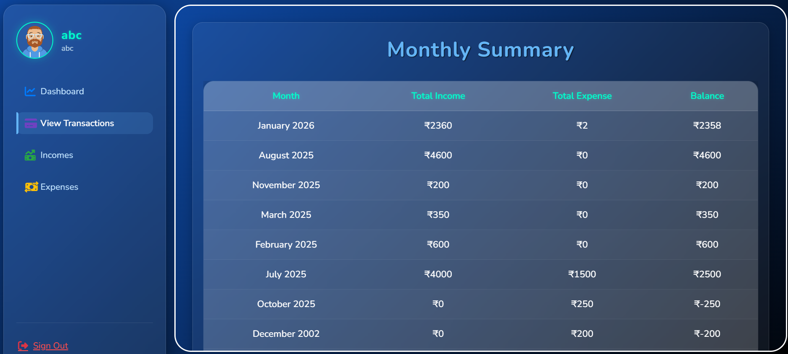
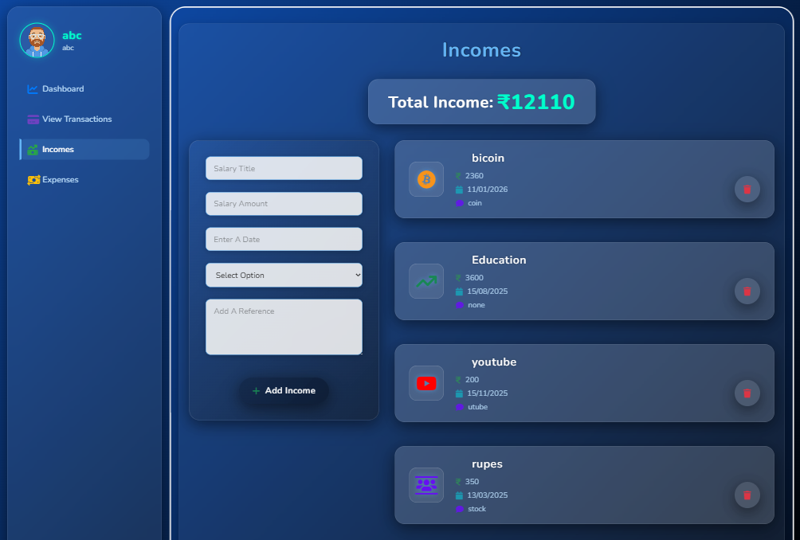
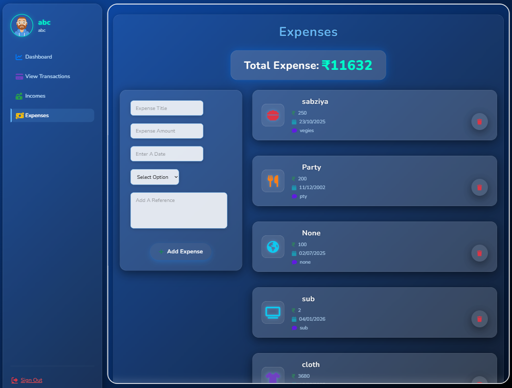

<h1 align="center">FinTrack</h1>

  

---

## 📖 Introduction

**FinTrack** is a full-stack expense tracker app built using the **MERN stack**. It allows users to manage their finances efficiently with a beautiful dashboard and visual charts. Users can securely log in, track incomes and expenses, and maintain a combined transaction history.

---

## ✨ Features

- 🔐 User Signup & Login with secure password hashing
- ➕ Add Income
- ➖ Add Expense
- 📊 Display of Income & Expense through charts
- 🧾 Combined Transaction History
- 🧹 Delete Income or Expense entries
- 📋 Beautiful and responsive dashboard

---

## 🛠️ Tech Stack

### 💻 Frontend:
- React.js

### 🌐 Backend:
- Node.js
- Express.js

### 🗄️ Database:
- MongoDB

### 🔒 Authentication:
- JWT (JSON Web Token)
- Bcrypt for password hashing

---

## 📷 Screenshots

  
  
  
  
  
  

